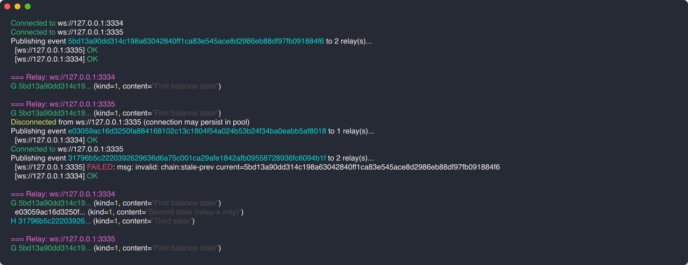
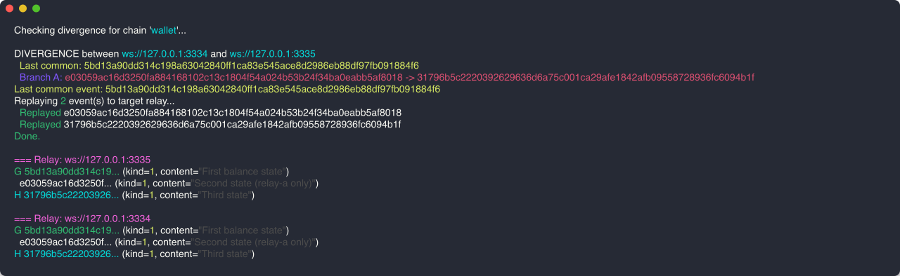

# serial-killer

A Nostr relay implementing **NIP-EC** — relay-enforced linear event chains.

**The problem:** Nostr clients that maintain ordered state (wallets, document history) have no way to prevent conflicting writes. Two clients can publish different "next states", and relays silently diverge.

**The fix:** Tag your events with `["chain"]` to opt in. The relay accepts a new event only if its `["prev"]` matches the current head. Stale writes are rejected. No silent forks.

---

## Demo: divergence and recovery

Start two relays (`just run-relays`), then run the interactive client (`just run-client`).

### Connect, genesis, diverge

Connect to both relays, publish a genesis event, disconnect one relay, append to only the first, then reconnect and try to append to both. The second relay rejects with `stale-prev` — it missed an event.



`G` marks the genesis, `H` marks the current head. Relay-a has advanced to the third event; relay-b is still at the genesis.

### Detect and fix

`diverge` finds the last common event and shows which branch each relay is on. `fix` replays the missing events from the canonical relay onto the diverged one.



Both relays are now in sync.

---

## Chain event format

**Genesis** (starts a chain):

```json
{
  "tags": [["chain"], ["d", "wallet"]]
}
```

**Append** (extends the chain):

```json
{
  "tags": [["chain"], ["d", "wallet"], ["prev", "<current-head-id>"]]
}
```

If no `["d"]` tag is present, the chain name defaults to the event kind as a string.

## Opting out

To dissolve a chain, publish an event for the same key with `["prev", "<current-head>"]` but without `["chain"]`. The relay accepts it and removes chain enforcement — subsequent events no longer need `prev`.

## Deletion and rollback

Send a standard NIP-09 kind-5 event referencing the chain head by `e` tag. The head rewinds to the deleted event's `prev`. Deleted events cannot be reactivated.

## Running

**Requirements:** Go 1.21+, [just](https://github.com/casey/just)

```sh
just build-all    # compile relay and client
just run-relay    # start relay on :3334
just run-relays   # start two relays on :3334 and :3335
just run-client   # start interactive REPL
just test         # run tests
```

### REPL commands

```
connect <url>                         connect to a relay
disconnect <url>                      disconnect
relays                                list connected relays
genesis [chain=NAME] [kind=N] <text>  start a new chain
append  [chain=NAME] [kind=N] <text>  extend the chain
query-all <chain>                     show chain from all connected relays
diverge <chain>                       detect divergence across relays
fix <relay> <chain> <canonical>       reconcile a diverged relay
delete <relay> <chain> <event-id>     delete a chain event
```
